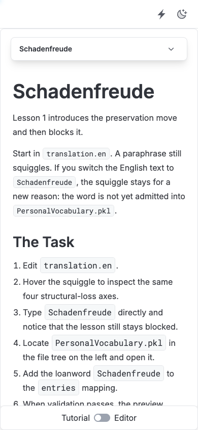

# null-hype.github.io — Agent Governance Walkthrough



> **Live Deployment:** [null-hype.tidelands.dev](https://null-hype.tidelands.dev)  
> **Source Engine & Evidence:** [github.com/null-hype/agent-plugins](https://github.com/null-hype/agent-plugins)

## Overview

Automated changes can each pass the same policy check and still violate it when merged cleanly. This project makes agent proposals reviewable through typed checks, linked evidence, and recorded supervisor exceptions that preserve prior verdicts.

This repository hosts the interactive, in-browser TutorialKit walkthrough that allows engineers, security teams, and researchers to step through multi-agent merge anomalies and evidence reconciliation.

---

## Architecture at a Glance

```
Browser (WebContainers / TutorialKit)
  │
  ├──► Monaco Editor & Terminal
  │      └── Renders typed GovernanceDiagnostics (CodeLens / Hovers)
  │
  ├──► Evaluator Engine
  │      ├── Git Merge Simulator (detects syntax vs semantic drift)
  │      └── Policy Evaluator (v1 baseline rules vs v2 scoped exceptions)
  │
  └──► Retained Verdict Record
         └── Preserves original FAIL @ v1 alongside PASS @ v2
```

---

## Quick Start (Run Locally)

Prerequisites: Node.js 18+

```bash
# Run the tutorial subproject
cd tutorial-app
npm ci

# Start local Astro/TutorialKit dev server
npm run dev

# Run test suite
npm test

# Build production bundle
npm run build
```

---

## What the Walkthrough Demonstrates

The core interactive experience is the **Budget Authority Walkthrough** (`/part-3/proposal-p-against-the-budget`):

1. **Jev types the answer:** Worker agent generates a travel proposal asserting compliance with travel policy.
2. **Git merges the two branches:** Airfare 890 and ground 400 branches merge with zero textual conflicts (`clean · 0 conflicts`).
3. **Checks evaluate P under v1:** Semantic evaluation intercepts the proposal: total is **$1,290 against a policy cap of $1,200** (`FAIL @ v1`).
4. **Supervisor grants exception:** A scripted supervisor turn records a one-time override ($1,200 → $1,300) scoped strictly to Proposal P.
5. **Checks re-evaluate P under v2:** Proposal re-evaluates as `PASS @ v2` while retaining the prior `FAIL @ v1` on the evidence record.

---

## Key Lessons & Evidence Links

- **Interactive Walkthrough (Part 3):** [Proposal P against the budget](https://null-hype.tidelands.dev/part-3/proposal-p-against-the-budget/1-jev-types-the-answer)
- **Diagnostic Provenance (Part 2):** [Where did this diagnostic come from?](https://null-hype.tidelands.dev/part-2/chapter-1/lesson-1)
- **Hands-on Reconciliation Lab (Part 1):** [Repair the disagreement, preserve evidence](https://null-hype.tidelands.dev/part-1/chapter-3/lesson-5)
- **Claim → Evidence Matrix:** [docs/launch/claims-evidence.md](https://github.com/null-hype/agent-plugins/blob/main/docs/launch/claims-evidence.md)
- **Core Engine & CLI Verifier:** [null-hype/agent-plugins](https://github.com/null-hype/agent-plugins)

---

## Limitations & Research Status

- **Prototype Scope:** Evaluated on synthetic fixtures and CI-exported telemetry; not a production enterprise IAM or firewall control.
- **Computed Arithmetic, Scripted Flow:** In the walkthrough, the git merge and budget calculations are computed for real, but turn progression is scripted and the approval boundary is simulated.
- **Static vs Runtime:** Boundary bypass checks statically verify absence of gate calls; runtime enforcement requires integration with host proxy/vault runtimes.

---

## Contact & Collaboration

- **Public Collaboration & Issues:** [Open an issue on agent-plugins](https://github.com/null-hype/agent-plugins/issues/new?template=apply-this.yml) (public; do not post secrets).
- **Private Enquiries (Consulting, Research Collaboration, Advisory, Funding):** Email [`public.rant@pm.me`](mailto:public.rant@pm.me) to discuss internal agent systems. Please outline your workflow context; do not send credentials or unredacted secrets in initial outreach.
